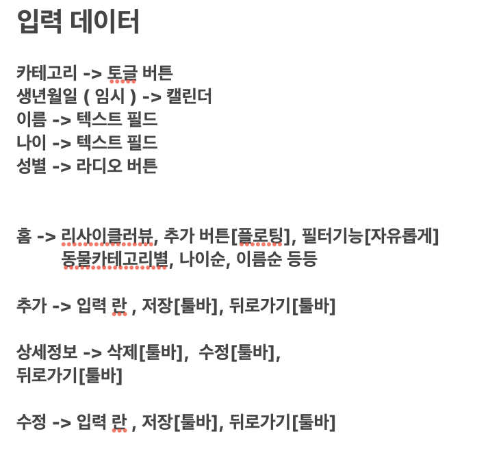

# 동물관리 어플

---

## 홈 화면
- 토글 바
- 리사이클러 뷰
- FAB 버튼 (동물 추가 화면으로 넘어가기 위한 버튼)

## 동물 추가 화면
- 토급 바 (뒤로 가기, 저장)
- 강아지|고양이|앵무새 -> 토글 버튼
- 생년월일 (임시) -> 캘린더
- 이름 -> 텍스트 필드
- 나이 -> 텍스트 필드
- 성별 -> 라디오 버튼

## 동물 정보 보기 화면
- 토글 바 (뒤로 가기, 수정, 삭제)
- 입력한 정보

## 동물 정보 수정 화면 (입력해 놓은 정보가 유지되도록 할 수 있을까?)
- 토글 바(뒤로 가기, 저장)
- 강아지|고양이|앵무새 -> 토글 버튼
- 생년월일 (임시) -> 캘린더
- 이름 -> 텍스트 필드
- 나이 -> 텍스트 필드
- 성별 -> 라디오 버튼

---

